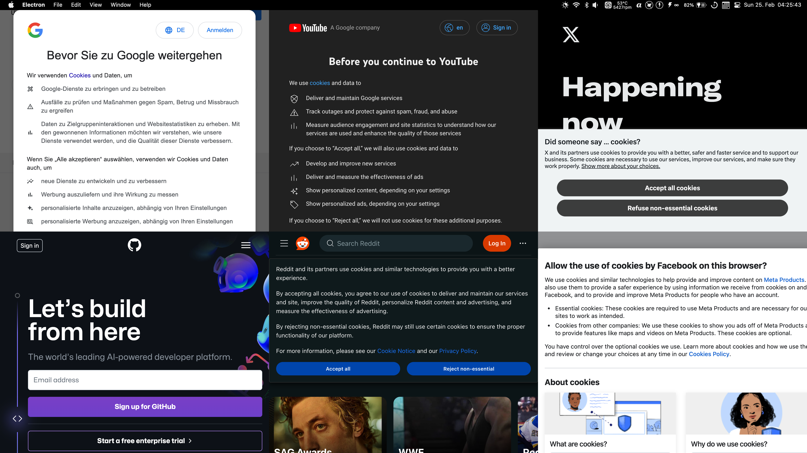

# hexatron

Electron dashboard with six (or any amount of) isolated browser views in a grid tile layout.

Originally built to have a 6 pane dashboard, it can show as many panes as desired in up to 2 rows.
It's recommend to limit it to 8 panes, or less.

## Download

There is no download, I do not plan to make a release. I use it for myself by calling the `electron`
command directly. I have no time for icons, metadata and distribution. Feel free to build it yourself.

## Usage

- Install nvm or node 20
- Clone the repository
- `nvm use` (if you use nvm)
- `npm install -g npx`
- `npm install`
- `npx electron . google.com youtube.com twitter.com github.com reddit.com facebook.com`

<kbd></kbd>

## Features and Roadmap

- No resizing of panes
- No icons
- No metadata
- No distribution
- No build system
- No tests
- No documentation
- No support
- No roadmap

## License

MIT
